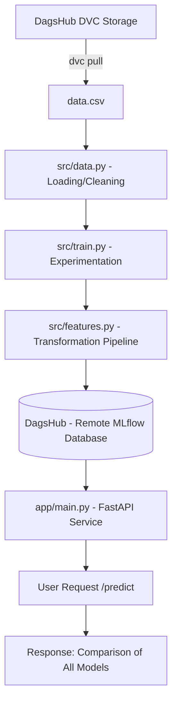

# 🏠 Seattle House Price Prediction: Multi-Model MLOps System (DagsHub + DVC)

This project is a production-grade MLOps system for predicting house prices in the Seattle area (King County). It demonstrates a complete lifecycle: from **Data Versioning (DVC)** and custom feature engineering to remote experiment tracking with **MLflow/DagsHub** and comparative serving via **FastAPI**.

---

## 🚀 1. Project Overview
The goal of this project is to build a reproducible pipeline that minimizes Training-Serving Skew and provides a central registry for all machine learning experiments and datasets.

### Key MLOps Features:
- **Data Version Control (DVC)**: `data.csv` is tracked and versioned via DVC, with remote storage hosted on DagsHub.
- **Remote Experiment Tracking**: Integrated with DagsHub for collaborative model management.
- **Multi-Model Inference**: The API serves predictions from **all** active models in the experiment (Linear Regression, Random Forest, Gradient Boosting) for side-by-side comparison.
- **Champion Indicator**: The API automatically identifies the "Champion" model (lowest RMSE) in the response.
- **Robust Pipelines**: Preprocessing and training are coupled in Scikit-learn Pipelines.
- **Input Validation**: Zero-day protection for the model via Pydantic schemas.

---

## 🏗️ 2. Architecture


---

## 📊 3. Dataset & Data Versioning
The dataset covers house sales in King County, USA.

### Tracking with DVC:
To ensure every experiment is tied to a specific data version, we use DVC.
- **Tracked File**: `data.csv` (ignored by Git).
- **Metadata**: `data.csv.dvc` (tracked by Git).
- **Remote Storage**: DagsHub S3-compatible storage.

---

## 🛠️ 4. How to Run

### Install Dependencies:
```bash
pip install -r requirements/train.txt
pip install -r requirements/api.txt
```

### Pull the Data:
```bash
dvc pull
```

### Train and Track:
Ensure your DagsHub environment variables are set to log remotely:
```bash
$env:DAGSHUB_REPO_OWNER = "abubakrmohibrahim"
$env:DAGSHUB_REPO_NAME = "House-Price-Prediction-Mlops"
python -m src.train
```

### Run Serving API:
The API will automatically find all models in your DagsHub registry.
```bash
uvicorn app.main:app --reload
```

---

## 🎓 5. Interview Q&A (MLOps Focus)

**Q: Why use DVC instead of just committing the CSV to Git?**
> Git is not designed to handle large binary files or datasets. DVC allows us to store the data in an external bucket (like DagsHub or S3) while maintaining a lightweight pointer in Git. This ensures that we can "switch" between data versions as easily as we switch between code branches.

**Q: Why serve multiple models instead of just the champion?**
> This supports "Shadow Mode" and comparative testing. It allows stakeholders to see how a complex model (like Random Forest) compares to a baseline (Linear Regression) in real-time, helping to justify the added complexity or identify edge cases where one model outperforms the other.

---

## ⚠️ 6. Limitations & Future Work
- **CI/CD**: The next step is a GitHub Action that runs the `tests/` on every commit.
- **DagsHub Pipeline**: Integrating `dvc.yaml` to automate the re-training of models on data changes.
